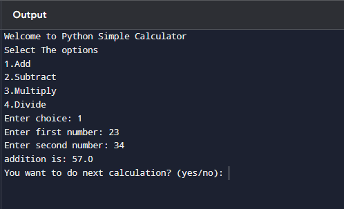

# Python Simple Calculator   
### Build a basic calculator that takes two numbers and an operator as input, then performs the chosen operation.    

 These is used to calculate a simple mathematical calculations like addition,subtraction,nultiplication and division.      
 Their is an example that if we wanted to calculate addition then we have to enter choice as 1 and then we have to give numbers like 23 and 45 then we get the result as 68.   
  
# Example(output)  
  

[Task 1 Output](./../../images/basic-task_1_results.png)  
