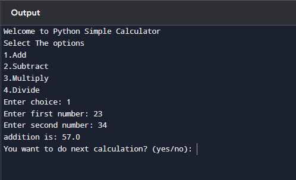

# Python Simple Calculator   
### Build a basic calculator that takes two numbers and an operator as input, then performs the chosen operation.    

 These is used to calculate a simple mathematical calculations like addition,subtraction,nultiplication and division.      
 Their is an example that if we wanted to calculate addition then we have to enter choice as 1 and then we have to give numbers like 23 and 45 then we get the result as 68.   
  
 ### simple_calculator Source code
 1. Create a file name [simple_calculator.py](./simple_calculator.py) with below content
 ```py
def add(x, y):
    return x + y
def subtract(x, y):
    return x - y
def multiply(x, y):
    return x * y
def divide(x, y):
    return x / y
print("Welcome to Python Simple Calculator")
print("Select The options")
print("1.Add")
print("2.Subtract")
print("3.Multiply")
print("4.Divide")
while True:
    choice = input("Enter choice: ")
    if choice in ('1', '2', '3', '4'):
        try:
            num1 = float(input("Enter first number: "))
            num2 = float(input("Enter second number: "))
        except ValueError:
            print("Invalid input. Please enter a number.")
            continue
        if choice == '1':
            print("addition is:",add(num1 , num2))

        elif choice == '2':
            print("Subtraction is:", subtract(num1, num2))

        elif choice == '3':
            print('Mutlipication is:',multiply(num1, num2))

        elif choice == '4':
            print('Division  is:', divide(num1, num2))
        next_calculation = input("You want to do next calculation? (yes/no): ")
        if next_calculation == "no":
            print("Thank you for using Python Calculation")
            break
    else:
        print("Invalid Input")

 ```
 2. Then run the source code with below command.
    ```py
    python simple_calculator.py 
 
    ``` 

# Example(output)  
  
