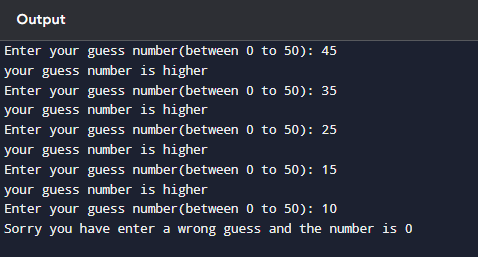

  # Guess_the_numbers
### Generate a random number and ask the user to guess it. Give hints if the guess is too high or too lt  
 This is a game that based on numbers.In this a number is given randomly between the range 0-50.   
 we have to guess the random number.     
 we have five chances of guessing the correct random number.so, if we guess the random number might be  greater than or lower than the random value.if we guess lower number then it shows "your guess number is lower",and if we guess a number that greater than the random number then it shows "your guess number is higher".   
 If our five guesses are incorrect then it shows us as"sorry you have entered a wrong guess",and it shows the random number as the result.
  
  
  
  
  
  # Example(output)
