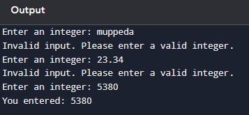

# Integer Errors   
### Create a program that asks the user for an integer input and handles invalid inputs.
This program tells about  not to enter a non-numeric characters **(eg"ajay")**    
And also notfloating values like **12.34,34.45**      
We have to enter a valid integer value for it (or) it will show an error in the output      
if we enter an vaild value for it it will show you have entered an integer **("eg, You entered : 1244")**   
  
  
  
 ### Integer Errors Source code
 1. Create a file name [integer_value.py](./integer_value.py) with below content
 ```py
def get_integer_input(prompt):
    while True:
        try:
            return int(input(prompt))
        except ValueError:
            print("Invalid input. Please enter a valid integer.")

def main():
    prompt = "Enter an integer: "
    user_input = get_integer_input(prompt)
    print(f"You entered: {user_input}")

if __name__ == "__main__":
    main()
 ```
 2. Then run the source code with below command.
    ```py
    python integer_value.py 
 
    ``` 
# Example(output)


