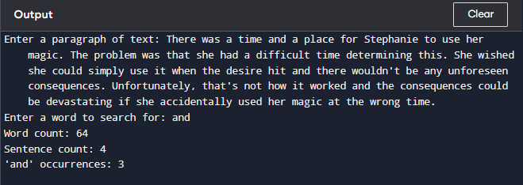

# Word Finding
 ***Ask the user for a paragraph of text and count the words, sentences, and occurrences of a particular word***
 First the user ask to enetr a paragraph and then it will ask what the word to search for after entering the word it will count the number of words that are present in the paragraph and will also show how many sentence are present in the paragraph and at last it will show that for what word we search for and how many times it repeats in the paragraph it will displayed.    

# Word Finding Source code
1. Create a file name [word_finding.py](./word_finding.py) with below content
```py
def count_words(text):
    words = text.split()
    sentences = text.replace('?', '.').replace('!', '.').split('.')
    sentences = [s for s in sentences if s.strip() != '']
    return len(words), len(sentences)
def count_word(text, word):
    return text.lower().count(word.lower())
def main():
    text = input("Enter a paragraph of text: ")
    word = input("Enter a word to search for: ")
    word_count, sentence_count = count_words(text)
    occurrence_count = count_word(text, word)
    print(f"Word count: {word_count}")
    print(f"Sentence count: {sentence_count}")
    print(f"'{word}' occurrences: {occurrence_count}")
if __name__ == "__main__":
    main()

```
2. Then run the source code with below command.
   ```py
   python word_finding.py 

   ```
 ### Example and output
