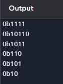

# Decimal to Binary
### Write a program that converts a decimal number to binary using bitwise operations.

This is used to convert a decimal number to a binary number  
By entering the decimal number and running the program it will give an output of the binary number.   
### Example (output)
